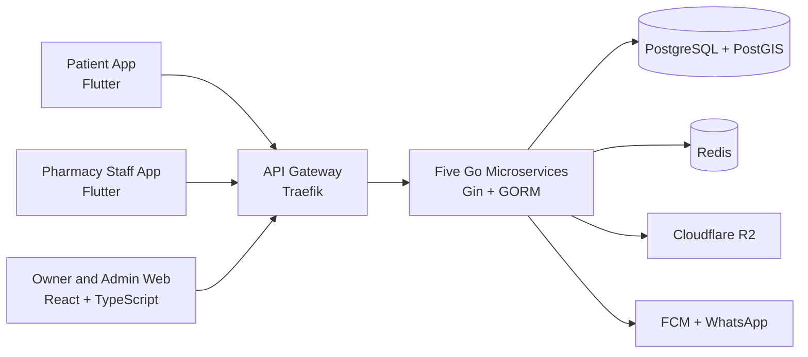

# FindMyMedi

**A trilingual medicine-discovery and pharmacy-operations platform built for Sri Lanka.**

[View Live MVP](https://findmymedi-web.vercel.app/) · [Developer Portfolio](https://bhashana99.vercel.app/)

> The live demo uses free-tier infrastructure and may take a short time to start after inactivity.

---

## The Problem

Finding a prescribed medicine in Sri Lanka often means calling or visiting multiple pharmacies without knowing whether the required items are available.

At the same time, many independent pharmacies lack affordable digital tools for publishing inventory, receiving reservations, and managing daily operations.

FindMyMedi connects both sides through location-aware medicine discovery and practical pharmacy-management workflows.

---

## Product Capabilities

### For Patients

- Search medicines using multilingual names and common aliases
- Scan medicine labels using on-device OCR
- Discover nearby pharmacies using location-based search
- Check medicine availability before travelling
- Submit prescription lists and reserve medicines
- Receive reservation and order updates

### For Pharmacies

- Manage medicine catalogues and inventory
- Receive and review reservation requests
- Respond to requested medicines item by item
- Manage orders, billing, and point-of-sale operations
- Notify patients through mobile and WhatsApp workflows
- Make available inventory discoverable to nearby patients

---

## How It Works

```text
Patient searches for a medicine
                ↓
Multilingual and fuzzy search identifies matching products
                ↓
PostGIS finds nearby pharmacies with available inventory
                ↓
Patient submits a reservation or prescription request
                ↓
Pharmacy reviews and responds to each requested item
                ↓
Patient receives confirmation and collects the order
```

---

## Technical Highlights

- **Microservices:** Five Go services built with Gin and GORM
- **Geospatial discovery:** PostgreSQL and PostGIS proximity search
- **Multilingual search:** PostgreSQL full-text search, `pg_trgm`, and a curated alias dictionary
- **Medicine-label scanning:** On-device OCR using Google ML Kit
- **Mobile applications:** Flutter apps for patients and pharmacy staff
- **Web platform:** React, TypeScript, Vite, and Tailwind CSS
- **Data and caching:** PostgreSQL, PostGIS, and Redis
- **Notifications:** Firebase Cloud Messaging and WhatsApp Business API
- **Infrastructure:** Docker, Traefik, DigitalOcean, and Cloudflare R2

---

## Architecture



---

## Technology Stack

| Area | Technologies |
|---|---|
| Backend | Go 1.22, Gin, GORM, REST APIs, Microservices |
| Mobile | Flutter 3.x, Google ML Kit |
| Web | React 18, TypeScript, Vite, Tailwind CSS |
| Database | PostgreSQL 16, PostGIS, Redis 7 |
| Search | PostgreSQL full-text search, `pg_trgm`, multilingual aliases |
| Notifications | Firebase FCM, WhatsApp Business API |
| Storage | Cloudflare R2 |
| Infrastructure | Docker, Traefik, DigitalOcean |

---

## Current Status

| Component | Status |
|---|---|
| Live web MVP | Available |
| Go backend services | Active development |
| Pharmacy web platform | Active development |
| Flutter mobile applications | Active development |
| Pilot pharmacy onboarding | Planned |

FindMyMedi is being developed iteratively, with the current MVP focused on validating medicine discovery, pharmacy search, reservations, and pharmacy-operation workflows.

---

## Source-Code Availability

FindMyMedi is organized across separate backend, mobile, web, and infrastructure repositories.

These repositories are currently private while the platform is in active product development. This organization profile documents the public product vision, architecture, capabilities, and technology stack.

---

## Project Ownership

FindMyMedi is independently designed and developed by **Bhashana Chamodya**, a Software Engineer working with Java, Spring Boot, Go, React, Flutter, microservices, and enterprise software systems.

[GitHub](https://github.com/bhashana99/) · [LinkedIn](https://www.linkedin.com/in/bhashana-chamodya/) · [Portfolio](https://bhashana99.vercel.app/) · [Email](mailto:bhashana.ai@gmail.com)

---

**Built in Sri Lanka, for Sri Lanka.**
